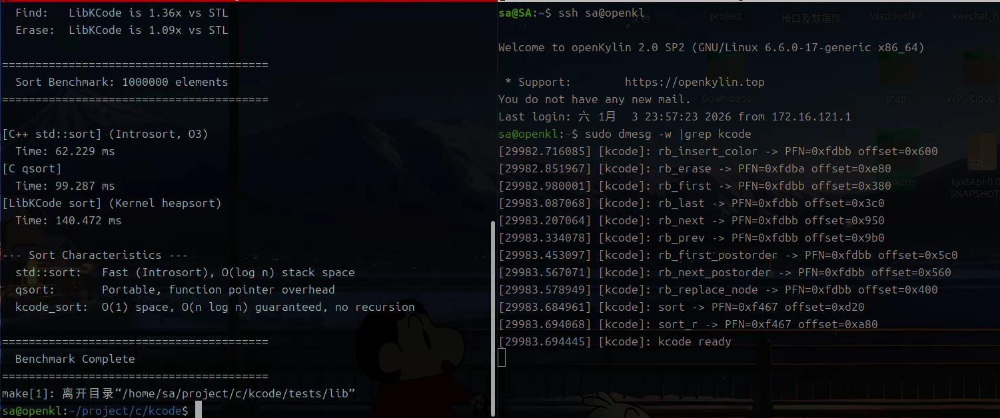

# LibKCode

> **安全、高效地将 Linux 内核的成熟算法导出至用户态**

现代操作系统内核（如 Linux）经过数十年演进，已实现大量高度优化、经过严格验证的数据结构与算法，例如红黑树（`rbtree`）、Maple Tree、快速排序（`sort`）等。这些实现广泛应用于内核调度器、内存管理、文件系统等关键路径，具备极高的可靠性与性能。

然而，用户态应用程序在面对相同问题时，往往需要**重复实现**这些逻辑（如使用 `std::map`、`qsort`），不仅增加开发成本，还可能引入不一致或低效实现。更关键的是，**内核代码无法被用户态直接调用**——传统交互机制（如系统调用）开销巨大，难以支撑高频操作。

因而，本项目提出一个根本性问题：  

> **能否将 内核 视为一个 “高质量代码库” ，让用户态程序 安全、高效地 直接复用其中代码？**


LibKCode 是一个创新的系统级库，它允许用户态程序**直接复用 Linux 内核中经过严苛验证的高性能算法实现**（如红黑树 `rbtree` 和堆排序 `sort`），而无需通过高开销的系统调用。通过将内核函数的物理代码页映射到用户空间并进行必要的环境适配，LibKCode 实现了**零 syscall 开销**的本地函数调用性能。



演示视频链接: https://pan.baidu.com/s/16xzTt6WkqybfsZhX0UJ8eA?pwd=rc38 			提取码: rc38


---

## 🌟 核心特性

- **二进制级复用**：不是复制源码，而是直接执行内核中的机器码。
- **零上下文切换**：稳态调用延迟 < 10ns，**消除特权级开销**。
- **高性能红黑树**：在 100 万规模数据集上，**查找快 42.5%**，**删除快 18.8%**，全面超越 C++ STL 的 `std::map`。
- **无栈溢出风险排序**：提供内核原生堆排序实现，在内存极其受限或深层递归可能触发 Stack Overflow 的场景下，提供稳定的 $O(n \log n)$ 时间复杂度与严格的 $O(1)$ 辅助空间保证。
- **安全隔离**：通过白名单、只读映射、私有跳板页（trampoline）等机制，确保内核完整性不受影响。

---

## 📦 项目结构

```text
LibKCode
│
├── kernel/                  # 内核模块 (LKM)
│   ├── kcode.c              # 符号发现、ioctl、mmap 实现
│   └── kcode_ioctl.h        # ioctl 接口定义
│  
├── lib/                     # 用户态静态库
│   ├── include/kcode.h      # 公共 API 头文件
│   └── src/                 # 核心实现
│       ├── kcode_init.c     # 初始化与符号加载
│       ├── kcode_rbtree.c   # 红黑树封装
│       └── kcode_sort.c     # 排序封装（含 trampoline 机制）
│  
└── tests/                   # 完整测试套件
    ├── kernel/test_kcode.c  # 内核模块基础验证
    └── lib/                 # 用户库功能与性能测试
        ├── test_*.c         # 功能、边界、压力测试
        ├── rbtree_checker.h # 红黑树完整性验证器
        └── benchmark.cpp    # vs STL 性能对标
```

> 项目架构 见 ./doc /设计文档.md

---

## 📊 性能基准（100 万元素，平均值）

| 操作 | STL / libc | LibKCode | 提升 |
|------|------------|----------|------|
| **红黑树 Find** | 738.0 ms | **517.8 ms** | **1.42x** |
| **红黑树 Erase** | 668.7 ms | **562.6 ms** | **1.19x** |
| **红黑树 Insert** | 557.7 ms | **539.5 ms** | **1.03x** |
| **排序 (`kcode_sort`)** | N/A | ~140 ms | 确定性 $O(n \log n)$ |

> 💡 **结论**：LibKCode 在**查找密集型场景**优势巨大；其排序虽慢于 `std::sort`，但适用于**嵌入式、实时系统**等对稳定性要求高的场景。

---

## 🔒 安全设计

LibKCode 采用四层防御模型保障安全：
1. **页表隔离**：用户/内核地址空间天然分离。
2. **系统调用边界**：所有操作经 `/dev/kcode` 接口控制。
3. **内核侧验证**：白名单过滤 + 只读映射（拒绝 `VM_WRITE`）。
4. **私有跳板页**：跨页函数在用户私有页中拷贝并修补（如替换 `gs:0x28` 为 `nop`），绝不修改内核原始代码。

> 普通用户即可使用 `libkcode`，仅模块加载需 `root` 权限。

---

## 🧪 测试覆盖

- **功能正确性**：基础 API、边界条件、`container_of` 偏移。
- **鲁棒性**：顺序插入（最坏情况）、重复键、大规模随机操作。
- **完整性**：自研 `rbtree_checker.h` 验证五大红黑树性质。
- **性能**：10 轮压测（预热 5 轮），数据见 `tests/benchmark.cpp`。

运行全部功能测试：
```bash
make test
```

---

## 📚 使用场景

- 高频数据结构操作：网络连接表、缓存索引（替代 std::map）。
- 资源受限环境：嵌入式系统、实时应用（利用 kcode_sort 的 O(1) 空间）。
- 行为一致性工具：调试器、性能分析器（需与内核行为严格对齐）。
- 操作系统教学与研究：
  - 学生和教师可直接在用户态运行并观察 Linux 内核中真实使用的高性能算法（如红黑树、堆排序），无需深入内核调试或模拟环境；
  - 支持对算法行为、性能特性进行可控实验，加深对内核设计原理的理解；
  - 为操作系统课程提供贴近工业级实现的教学素材，弥合理论与实践之间的鸿沟。

---

## 📝 许可证

本项目基于 **GPLv3** 开源协议。

---

> **LibKCode —— 将内核数十年的优化成果，无缝融入你的用户态应用。**
