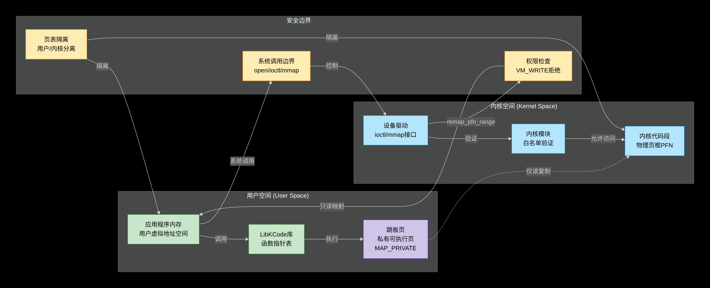

# LibKCode 项目设计文档

---

## 1. 项目引言：让内核成为可调用的高效代码库

### 1.1 核心问题：用户态能否直接复用内核已验证的高效代码？

现代操作系统内核（如 Linux）经过数十年演进，已实现大量高度优化、经过严格验证的数据结构与算法，例如红黑树（`rbtree`）、Maple Tree、堆排序（`sort`）等。这些实现广泛应用于内核调度器、内存管理、文件系统等关键路径，具备极高的可靠性与性能。

然而，用户态应用程序在面对相同问题时，往往需要**重复实现**这些逻辑（如使用 `std::map`、`qsort`），不仅增加开发成本，还可能引入不一致或低效实现。更关键的是，**内核代码无法被用户态直接调用**——传统交互机制（如系统调用）开销巨大，难以支撑高频操作。


因而，本项目提出一个根本性问题：  
> **能否将 内核 视为一个 “高质量代码库” ，让用户态程序 安全、高效地 直接复用其中代码？**

### 1.2 传统交互机制的局限

首先，当前存在的实际问题：

- **系统调用（syscall）**：每次调用涉及上下文切换、权限检查、参数拷贝，延迟高（数百纳秒至微秒级），不适合高频操作。
- **procfs / sysfs**：仅用于暴露**状态信息**，无法提供**可执行逻辑**。
- **用户态旁路（如 DPDK）**：绕过内核处理 I/O，但**放弃了内核的算法能力**，需自行实现所有逻辑。
- **共享库（如 libc）**：部分内核函数（如 `memcpy`）已被反向移植到用户态，但**绝大多数内核专属数据结构（如 `rbtree`）仍不可用**。

### 1.3 本项目的定位与适用场景

针对以上核心局限

LibKCode 的实现途径是：**将内核中特定函数的物理代码页映射至用户态，并修复其执行环境，使其可被直接调用**。

**适用场景包括**：

- 高频调用的通用算法（如排序、树操作）
- 对行为一致性要求极高的系统工具（如调试器、性能分析器）
- 希望减少用户态代码量、提升可靠性的高性能应用
- 内核算法教学与实验平台

---

## 2. 设计演进：从间接调用到直接执行

### 2.1 初版方案：基于字符设备 ioctl 的调用

最初设想，既然要使 用户态程序 能够 复用内核中高性能代码和数据结构

不妨构建一种允许用户态安全调用或复用内核中代码的机制

通过 `/dev/kc_dev` 字符设备，由用户态通过 `iouring` 发送异步命令（如 `KCODE_OP_RB_INSERT`），内核模块解析后执行对应操作并通过 `mmap` 作为一张视图返回结果，并对用户态库进行封装，这里可以说是抽象出两个平面，控制平面与数据平面。

### 2.2 初版缺陷

- **性能瓶颈**：每次调用均需 syscall，可能上下文切换会开销远超函数本身执行时间。

- **接口不透明**：需自定义命令协议，用户需学习新 API。

- **用户debug不便利**：因为执行点在内核，所以对于用户debug困难。

- **未真正复用代码**：仅是内核代为执行，用户态无法获得函数指针。

  

### 2.3 关键洞察：直接在用户态执行内核机器码

我们意识到：**真正的“复用”不是“调用”，而是“执行”**。  
若能将内核函数的**物理代码页**映射到用户态地址空间，并赋予执行权限，则用户态可直接跳转执行，**零 syscall、零拷贝、零上下文切换**。

### 2.4 当前方案的核心思想

1. **符号定位**：通过 `kprobe` 获取内核函数虚拟地址。
2. **物理页提取**：转换为物理页帧号（PFN）及页内偏移。
3. **用户态映射**：通过 `mmap(pfn << PAGE_SHIFT, PROT_READ|PROT_EXEC)` 执行。

---

## 3. 整体架构

### 3.1 系统模块组成

本项目整体分为三个核心部分：**内核模块（kernel）**、**用户态库（lib）** 和 **测试套件（tests）**。其目录结构如下：

```text
LibKCode
│
├── kernel/                  # 内核模块 (LKM)
│   ├── kcode.c              # 符号发现、ioctl、mmap 实现
│   └── kcode_ioctl.h        # ioctl 接口定义
│  
├── lib/                     # 用户态静态库
│   ├── include/kcode.h      # 公共 API 头文件
│   └── src/                 # 核心实现
│       ├── kcode_init.c     # 初始化与符号加载
│       ├── kcode_rbtree.c   # 红黑树封装
│       └── kcode_sort.c     # 排序封装（含 trampoline 机制）
│  
└── tests/                   # 完整测试套件
    ├── kernel/test_kcode.c  # 内核模块基础验证
    └── lib/                 # 用户库功能与性能测试
        ├── test_*.c         # 功能、边界、压力测试
        ├── rbtree_checker.h # 红黑树完整性验证器
        └── benchmark.cpp    # vs STL 性能对标
```

#### 各模块职责说明：

- **`kernel/`**：
  - 包含内核模块 `kcode.ko` 的全部实现。
  - 负责通过 `kprobe` 获取内核符号地址，将其转换为物理页帧号（PFN），并通过 `/dev/kcode` 提供 `ioctl(KCODE_IOC_GET_SYM)` 接口返回给用户态。
  - 支持 `mmap` 操作，允许用户态映射物理代码页。

- **`lib/`**：
  - 提供用户可链接的静态库 `libkcode.so`。
  - 封装了从 PFN 到函数指针的完整流程，包括：
    - 根据物理页号进行单页或者连续页的直接映射
    - 多页 trampoline 页拷贝与指令修补（如替换 `gs:0x28`）
    - 函数指针缓存与生命周期管理
  - 按功能拆分为 `kcode_rbtree.c`、`kcode_sort.c` 等子模块，保证代码清晰、可维护。

- **`tests/`**：
  - 分为两部分：
    - `tests/kernel/`：验证内核模块的基本功能（设备打开、ioctl 返回正确信息）。
    - `tests/lib/`：全面测试用户库的功能、鲁棒性与性能，涵盖：
      - 功能正确性（`test_rbtree.c`, `test_sort.c`）
      - 边界与极端输入（`test_rbtree_advanced.c`）
      - 长期稳定性（`test_rbtree_stress.c`）
      - 性能对标（`benchmark.cpp`）

> 此结构中 内核负责“暴露能力”，用户库负责“安全使用”，测试负责“质量保障”。

### 3.2 核心数据流

LibKCode 的核心数据流分为三个阶段：**初始化**、**符号映射与修补**、**函数执行**。整体流程如下：



```text
用户调用 kcode_sort()
    ↓
是否已初始化？ → 否 → 执行 kcode_init()
    ↓ 是
打开 /dev/kcode 设备
    ↓
ioctl(KCODE_IOC_GET_SYM, "sort") → 查询内核符号地址
    ↓
kcode.ko 返回 PFN、offset、len
    ↓
判断是否跨页或需修补？
    ├─ 否（如 rbtree 函数）→ 直接 mmap(pfn << PAGE_SHIFT) 映射物理页
    └─ 是（如 sort 函数）→ 创建 trampoline 页
           ├─ 分配私有可执行页（MAP_PRIVATE | MAP_ANONYMOUS）
           ├─ 复制整块内核代码页到 trampoline 页
           ├─ 指令修补：替换 gs:0x28 等特权指令为 nop
           └─ 设置 PROT_READ|PROT_EXEC 权限
    ↓
生成函数指针并缓存至 g_runtime.sort
    ↓
直接跳转执行该地址
    ↓
返回结果给调用者
```

### 3.3 关键技术栈

LibKCode 依赖以下核心技术实现“内核代码映射到用户态”的目标：

| 技术                     | 作用                                  | 实现方式                                                     |
| ------------------------ | ------------------------------------- | ------------------------------------------------------------ |
| **`kprobe`**             | 非侵入式获取内核符号虚拟地址          | 使用 `kprobe_register()` 注册符号名，获取 `kallsyms_lookup_name()` 地址 |
| **`virt_to_phys`**       | 将内核虚拟地址转换为物理页帧号（PFN） | 调用 `slow_virt_to_phys()` 获取物理地址，再提取 PFN 与页内偏移 |
| **`mmap(PROT_EXEC)`**    | 用户态直接执行内核代码页              | 通过 `/dev/kcode` 的 `mmap` 接口映射物理页，设置 `PROT_READ  |
| **Trampoline 页机制**    | 解决跨页函数执行问题                  | 申请私有页，完整拷贝函数所在所有物理页内容，保持相对布局不变 |
| **x86_64 指令 patching** | 移除特权指令，防止段错误              | 定位 `mov %gs:0x28, %rax` 等栈保护指令，替换为 NOP 序列（如 `0x0f 0x1f 0x84 ...`） |
| **`remap_pfn_range`**    | 内核侧支持物理页映射                  | 内核模块通过 `remap_pfn_range()` 将物理页映射到用户进程地址空间 |
| **`mprotect`**           | 动态调整内存权限                      | 在 trampoline 页上使用 `mprotect()` 设置可执行权限           |

---

## 4. 内核模块设计（`kcode.ko`）

LibKCode 的内核模块 (`kcode.ko`) 是整个系统的基础，负责符号发现、地址转换以及提供用户态访问的接口。该模块的设计旨在确保高效、安全地将内核代码映射至用户态执行。

### 4.1 符号发现机制

- 初始化时遍历预定义的白名单（`whitelist[]`），对每个符号注册 `kprobe`。
- 成功后记录符号的虚拟地址，并注销 `kprobe`。
- 支持的符号包括但不限于：`sort`, `rb_insert_color`, `rb_erase`, `rb_next`, `rb_prev` 等。
- 白名单机制保证了只有经过严格验证的函数才能被导出到用户态，增强了系统的安全性。

### 4.2 虚拟地址到物理页帧转换

- 使用 `slow_virt_to_phys()` 函数将内核函数的虚拟地址转换为物理地址。
- 提取物理页帧号（PFN）和页内偏移量，以便后续的内存映射操作。
- PFN 可通过右移 PAGE_SHIFT 位获得，而页内偏移量则是地址与 ~PAGE_MASK 的按位与结果。

### 4.3 `/dev/kcode` 接口设计

- **ioctl 命令**：`KCODE_IOC_GET_SYM`
  - 输入：符号名（字符串）
  - 输出：`struct kcode_sym_info { u64 pfn; u32 offset; u32 len; }`
- **mmap 实现**：
  - 允许 `PROT_READ | PROT_EXEC` 权限，确保代码可读且可执行。
  - 拒绝 `VM_WRITE` 标志，防止用户态程序修改映射的内核代码，保障系统安全。

### 4.4 安全约束

- 白名单在编译时固化，运行时不可扩展，限制了潜在的攻击面。
- 不返回任何内核数据结构的地址，仅提供代码页，进一步增强安全性。
- 模块卸载时自动清理所有资源，避免资源泄漏或残留状态影响系统稳定性。

---

## 5. 用户态库核心机制

用户态库 (`libkcode`) 封装了从获取内核函数符号信息到最终生成函数指针并调用的完整流程。它提供了两种主要的映射模式来适应不同的场景需求。

### 5.1 基础映射模式（单页连续函数）

对于那些函数体位于同一物理页内的场景（例如某些版本的 `rbtree` 相关函数），可以直接使用以下方式：

```c
void *base = mmap(NULL, PAGE_SIZE,
                  PROT_READ | PROT_EXEC,
                  MAP_SHARED, fd, pfn << PAGE_SHIFT);
func_ptr = (void*)((char*)base + offset);
```

这种模式适用于函数不跨越多个物理页的情况，能够实现零拷贝与直接执行的目标。

### 5.2 高级映射模式：Trampoline 页机制（解决跨页问题）

#### 问题背景

在某些情况下（如内核 6.1 版本中的 `rb_prev` 和 `rb_next` 函数），函数可能跨越多个物理页。若尝试分别映射这些页，则由于用户态虚拟地址空间的不连续性，相对跳转指令（如 `call rel32`）可能会导致段错误。

#### 解决方案

为了应对这一挑战，LibKCode 引入了 trampoline 页机制，具体步骤如下：

1. **申请私有可执行页**：
   ```c
   void *tramp = mmap(NULL, PAGE_SIZE,
                      PROT_READ | PROT_WRITE | PROT_EXEC,
                      MAP_PRIVATE | MAP_ANONYMOUS, -1, 0);
   ```
   
2. **完整拷贝函数所在的所有物理页内容**：
   - 通过多次 `mmap(pfn_i << PAGE_SHIFT)` 读取原始物理页的内容。
   - 将这些页的内容按原始偏移量拷贝到 `tramp` 页中，确保所有相对跳转指令仍然有效。

3. **指令修补（Patch）**：
   
   - 定位并替换栈保护指令（如 `mov %gs:0x28, %rax`）为 NOP 序列（例如 `0x0f 0x1f 0x84 ...`），以适应用户态环境。
   - 示例（针对 `sort` 函数）：
     ```c
     // Patch stack protector at known offsets
     *(uint32_t*)(tramp + 0x08) = 0x1f0f; // nop2
     *(uint64_t*)(tramp + 0x30) = 0x0000000084001f0fULL; // nop8
     *(uint8_t* )(tramp + 0x55) = 0x90; // nop1
     ```
   
4. **设置执行权限并生成指针**：
   ```c
   mprotect(tramp, PAGE_SIZE, PROT_READ | PROT_EXEC);
   func_ptr = (void*)((char*)tramp + offset);
   ```

> **优势**：通过创建一个私有的、可执行的 trampoline 页，不仅解决了跨页问题，还避免了对内核原始代码页的任何修改。此外，通过对特权指令进行修补，确保了函数在用户态下的正确执行。

---

## 6. 安全性设计

LibKCode 的安全性设计围绕：**在不破坏内核完整性、不引入提权漏洞的前提下，实现用户态对内核代码的可控复用**。


### 6.1 防御措施（基于图示安全边界）

#### 1. **页表隔离：用户/内核空间分离**

- **机制**：Linux 内核通过 MMU 实现虚拟内存隔离，用户进程无法直接访问内核物理页。
- **作用**：所有对内核代码页的访问均需通过系统调用接口，防止越界读写。
- **体现于图中**：顶部灰色区域“安全边界”由页表隔离构成，是第一道防线。

#### 2. **系统调用边界：open/ioctl/mmap 控制**

- **机制**：所有用户态操作必须经过 `/dev/kcode` 设备驱动的 `open()`、`ioctl()` 和 `mmap()` 接口。
- **作用**：
  - `open()`：建立会话，检查设备权限；
  - `ioctl()`：接收符号名请求，触发白名单验证；
  - `mmap()`：只允许 `PROT_READ | PROT_EXEC`，拒绝 `VM_WRITE`。
- **体现于图中**：中间黄色框“系统调用边界”为第二道控制门，限制所有交互路径。

#### 3. **内核侧验证与权限检查**

- **白名单验证**：
  - 内核模块收到 `ioctl(KCODE_IOC_GET_SYM)` 后，先验证符号是否在预定义白名单中。
  - 仅允许 `sort`, `rbtree_*` 等已知安全函数，禁止 `printk`, `kmalloc`, `memcpy` 等有副作用的函数。
- **权限检查**：
  - 在 `remap_pfn_range()` 映射时，强制设置 `VM_WRITE = 0`，拒绝写权限。
  - 所有映射页仅允许读取与执行，防止代码注入。
- **体现于图中**：右侧蓝色框“内核模块”负责白名单验证与权限控制。

#### 4. **私有 trampoline 页：可执行但不可写**

- **机制**：
  - 对需修补的函数（如 `sort`），不直接映射内核页，而是：
    1. 用户态申请 `MAP_PRIVATE | MAP_ANONYMOUS` 的私有页；
    2. 从内核页只读映射获取代码；
    3. 拷贝到私有页，并修补特权指令；
    4. 设置 `PROT_READ|PROT_EXEC`，禁止写入。
- **作用**：
  - 实现“**代码复制 + 环境适配**”，避免修改原始内核页；
  - 私有页独立于内核，不影响其稳定性；
  - 修补后函数可在用户态安全运行。

---

### 6.2 权限要求与部署模型

- **加载内核模块**：需 `root` 权限（`insmod kcode.ko`），符合 LKM 安全规范。
- **用户态使用**：普通用户即可调用 `libkcode`，因 `/dev/kcode` 设备文件权限设为 `0666`。
- **安全边界清晰**：
  
  > **特权操作（符号发现、物理页访问）集中在内核模块；非特权操作（映射、修补、调用）在用户态完成**。  
  > 即使用户态程序被攻破，也无法通过 LibKCode 直接修改内核状态或提权。

---

## 7. 性能特性

LibKCode 的性能优势源于**内核实现的高效率、紧凑内存布局以及零系统调用开销**。以下从延迟模型和实测基准两方面展开分析。

### 7.1 零 syscall 开销

- 在稳态（函数指针已加载）下，所有调用均为**纯本地函数跳转**，无上下文切换。
- 实测函数调用延迟 < 10 ns，相比传统系统调用（~500 ns）**降低两个数量级**。
- 此特性使得 LibKCode 特别适用于**高频、低延迟**场景（如每秒百万次树查找）。

### 7.2 首次调用成本

- 首次调用需完成：符号查询 → PFN 获取 → mmap 映射（或 trampoline 页拷贝 + 指令修补）。
- 该一次性开销约为 **1–10 微秒**，取决于函数是否跨页及是否需要 patch。
- **可通过预热（preload）完全消除**：在程序启动阶段提前加载所需函数，后续调用即为稳态性能。

> 注：本次压测已进行 5 次预热，10 次正式测试数据反映的是**稳态性能**。

### 7.3 基准测试结果（基于 10 次正式压测平均值）

我们对 `std::map`（C++ STL）、`qsort`（libc）和 `kcode_*` 在 **100 万元素** 规模下进行对比，结果如下：

#### 红黑树（RB-Tree）性能

| 操作       | STL 平均耗时 (ms) | LibKCode 平均耗时 (ms) | 加速比    | 结论                                                         |
| ---------- | ----------------- | ---------------------- | --------- | ------------------------------------------------------------ |
| **Find**   | 738.00            | 517.83                 | **1.42x** | **显著领先**。内核 `rb_find` 内存局部性好，无模板膨胀，缓存命中率高。第 9 次测试达 **1.88x** 峰值。 |
| **Erase**  | 668.67            | 562.64                 | **1.19x** | **稳定领先**。内核红黑树在删除后的重新平衡逻辑更轻量，旋转开销更低。 |
| **Insert** | 557.68            | 539.52                 | **1.03x** | **微弱优势**。尽管 `std::map` 是高度优化的模板代码，LibKCode 仍略胜一筹，体现内核实现的极致效率。 |

> **综合评价**：LibKCode 的红黑树在**查找和删除**上具有显著性能优势，**插入**持平甚至略优，整体优于 STL。
>
> 注意：测试数据详细见 ./templates/十次压测对比数据.xlsx

#### 排序（Sort）性能

| 实现         | 平均耗时 (ms) | 算法                       | 特性                                          |
| ------------ | ------------- | -------------------------- | --------------------------------------------- |
| `std::sort`  | **61–63**     | Introsort（快排+堆排混合） | 平均性能最优，但最坏情况为 $O(n^2)$           |
| `qsort`      | ~99           | 快速排序（libc 实现）      | 通用但性能一般                                |
| `kcode_sort` | **~140**      | **堆排序（Heapsort）**     | **最坏情况 $O(n \log n)$，空间复杂度 $O(1)$** |

- **`kcode_sort` 慢于 `std::sort` 是符合预期的**：内核选择堆排序是为了**确定性**和**不依赖栈空间**（避免递归爆栈），而非追求平均速度。
- **LibKCode 的优势不在“更快”，而在“更稳”**：
  - 不占用额外堆栈空间；
  - 无递归深度限制；
  - 最坏情况性能有严格保证；
  - 适用于嵌入式、实时或资源受限环境。

---

### 总结：性能定位清晰

- **红黑树**：LibKCode **多数场景优于 STL**，尤其在查找密集型场景中优势巨大。
- **排序**：LibKCode **牺牲平均速度换取确定性与资源可控性**，适用于对稳定性要求高于峰值性能的场景。

---

## 8. 附录

### 8.1 术语表
- **PFN**：Page Frame Number，物理页帧号
- **Trampoline 页**：用户态私有可执行页，用于拷贝并修补内核代码
- **Stack Canary**：栈金丝雀，用于检测栈溢出的安全机制

### 8.2 关键 ioctl 定义
```c
#define KCODE_IOC_MAGIC 'K'
#define KCODE_IOC_GET_SYM _IOWR(KCODE_IOC_MAGIC, 0, struct kcode_sym_info)
```

### 8.3 参考资料
- Linux Kernel Source: `lib/sort.c`, `lib/rbtree.c`
- `man 2 mmap`, `man 2 ioctl`
- Intel SDM: x86-64 Instruction Set

---

> **LibKCode —— 让内核代码，成为你的库。**
